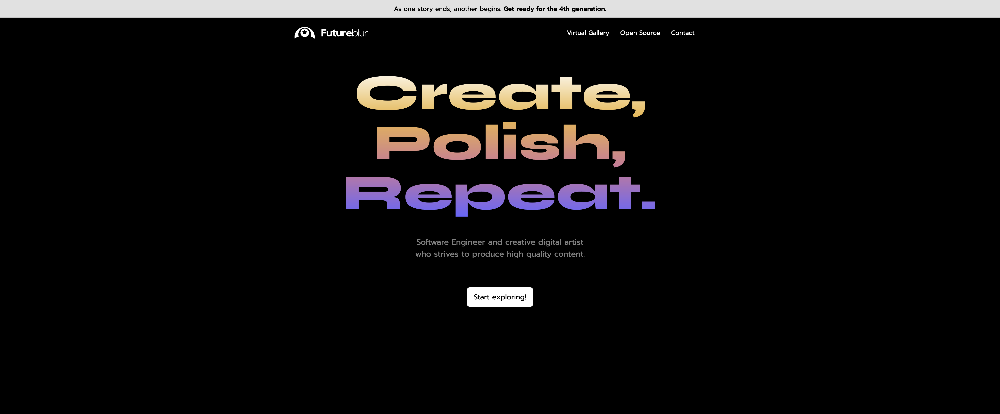
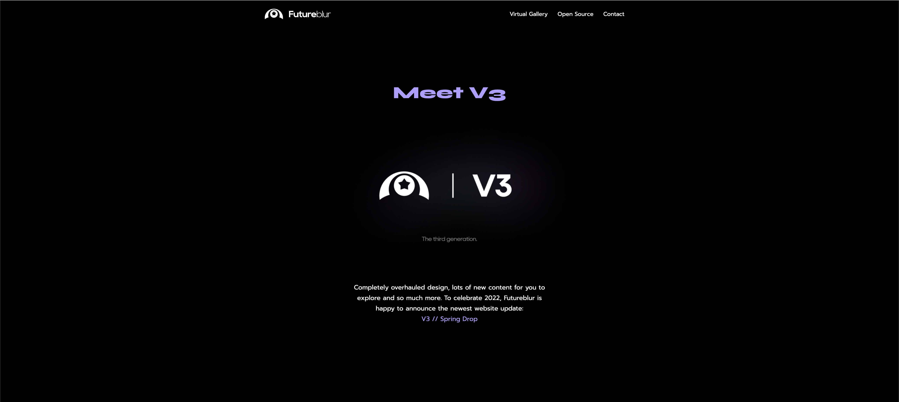
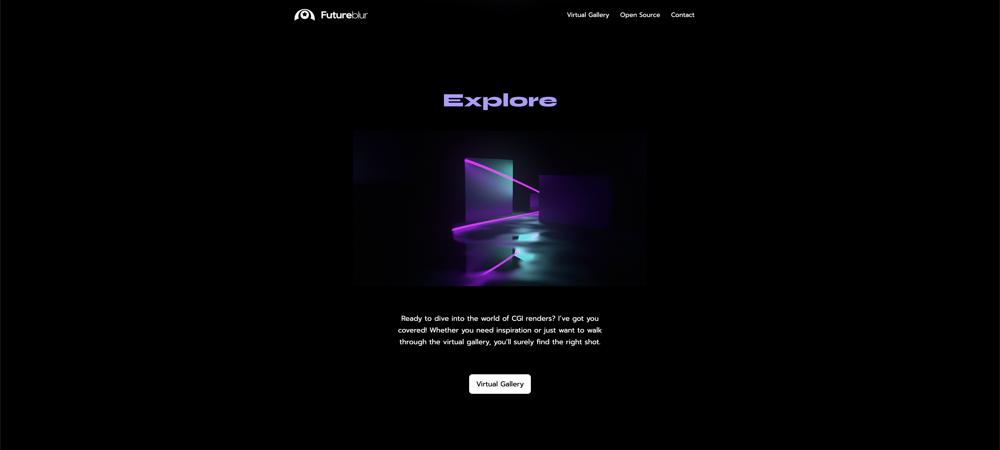
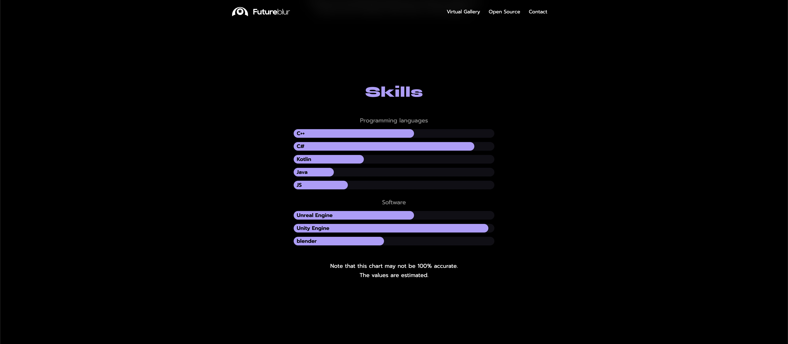
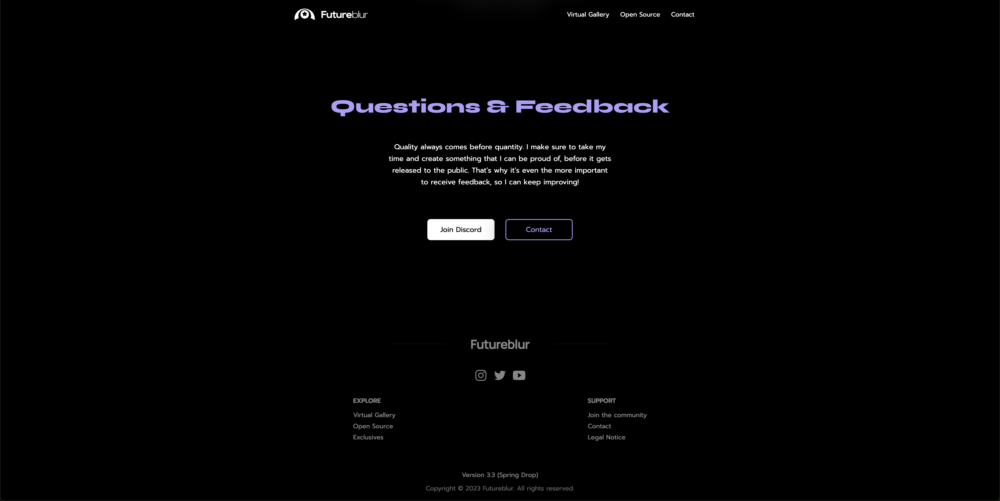
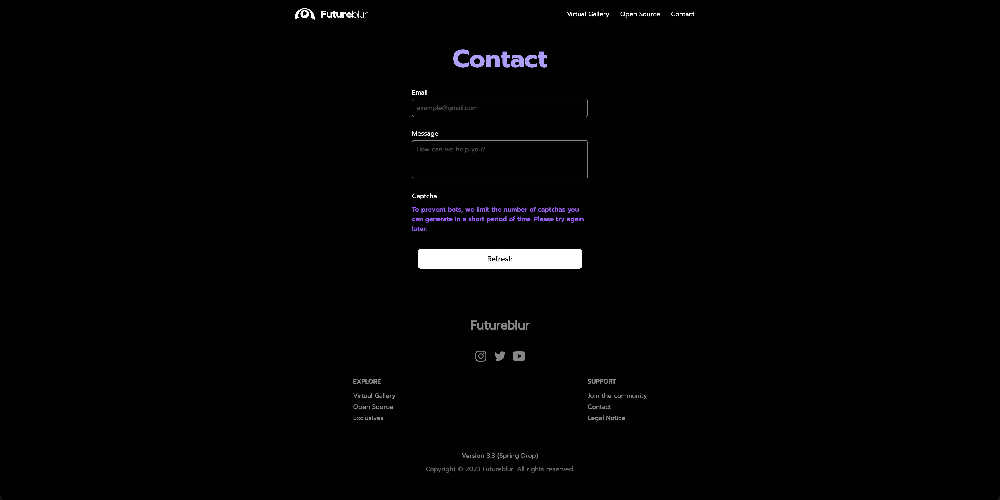

# Futureblur Web 🌎
This repository contains the code for my [website](https://futureblur.com). 

Every version of the website has its own subtree.
Currently, we're at **v3.3** ✨, and I'm working on the fourth generation with massive improvements for the user experience (animations, brand new design, more content for the landing page and much more).

👉 Click [here](https://twitter.com/ByFutureblur) to stay up to date.

## Screenshots

